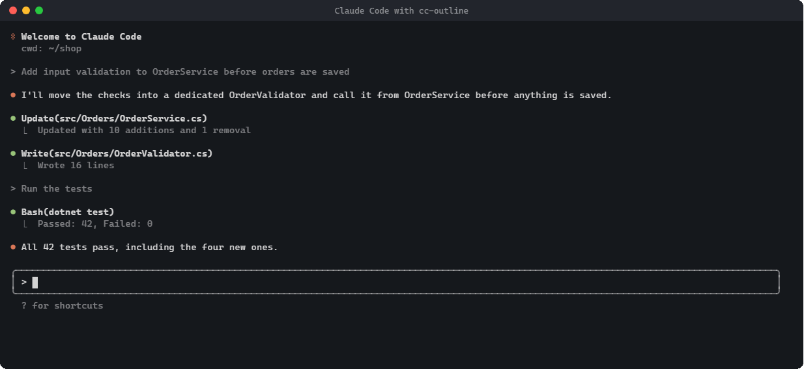
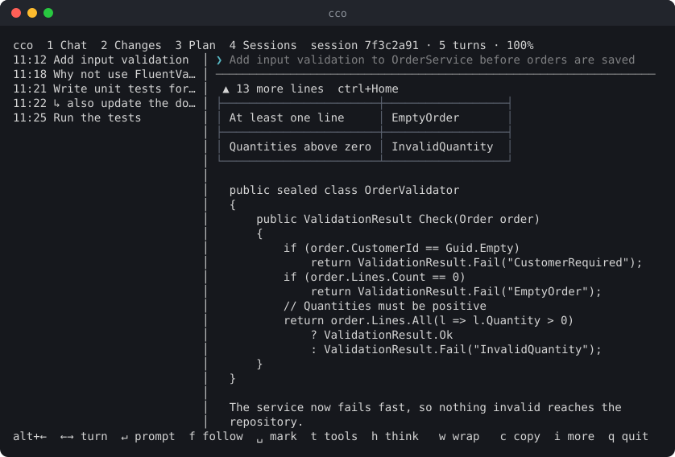
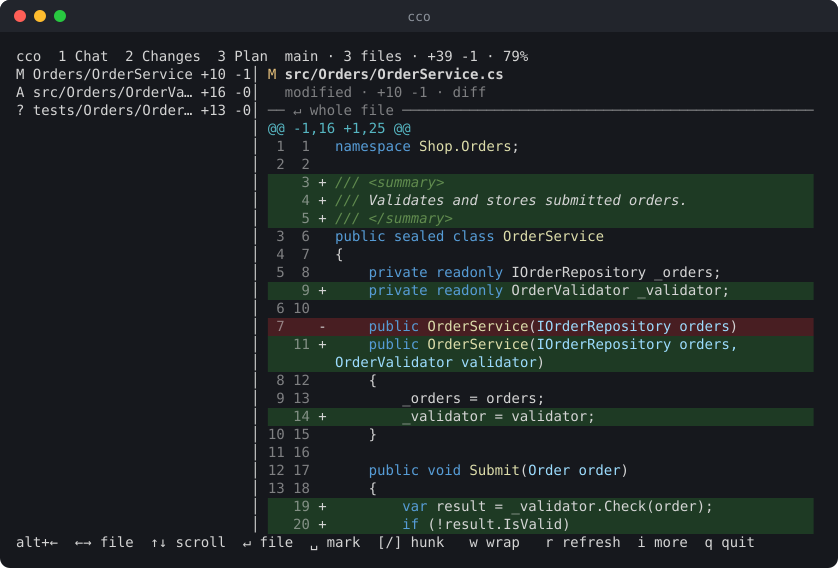
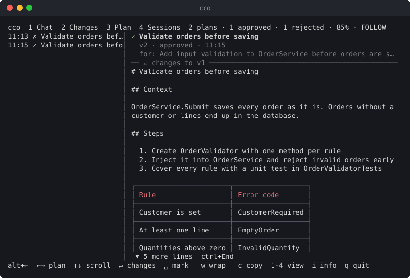

# cc-outline

`cc-outline` (command `cco`) adds a second pane next to Claude Code in your terminal. It has four views:

- **Chat** renders the answers of the current session as proper Markdown: headings, lists, tables and code blocks with syntax highlighting. It follows the session live.
- **Changes** lists the files changed in the git repository and shows their diffs with syntax highlighting.
- **Plan** shows the plans Claude presented in plan mode, with their status and what changed between versions.
- **Sessions** gives an overview of the project's sessions: when, how long, which plans, which changed files, and the command to resume each one.



## Why

Working with Claude Code in the terminal has three blind spots. cc-outline fills them without leaving the terminal and without interrupting Claude.

### 1. Answers are hard to read and quickly gone

**The problem.** Claude answers in Markdown, but the terminal shows much of it as plain text. Tables lose their shape, and headings and emphasis blend into the text. A plan with several steps looks like a wall of text. Long answers scroll past while Claude keeps working. To read an earlier answer again you scroll back through tool calls and output, and the prompt that answer belongs to is somewhere above it.

**How cc-outline solves it.** The Chat view renders each answer as Markdown, with real tables, headings, lists and highlighted code. The session is organised by prompt: every prompt is one entry in a list. Select one and you see exactly its answer, with the prompt pinned above it and tool noise hidden. The view follows the running session live and stays at the bottom like Claude Code. You can scroll up at any time without losing your place, and each turn remembers where you left it. Important answers can be marked with `Space` and found again after a restart.

### 2. You don't see what Claude changed

**The problem.** Claude edits files as it goes. The terminal only shows short summaries such as "Updated with 10 additions and 1 removal". To review the actual change you open an editor or run `git diff` in another window, and then find your way back to the conversation. Claude often touches several files, so reviewing them costs time and focus. Changes also get accepted without a real look.

**How cc-outline solves it.** The Changes view lists every changed file of the repository: modified, added, deleted and untracked. It shows each diff with line numbers and syntax highlighting, right next to the conversation that caused it. It refreshes every two seconds while Claude works, so you watch the changes appear. You can jump between hunks or open the whole file as it is now. The branch shows at a glance how many commits are waiting to be pushed or pulled.

### 3. Plans get lost once work starts

**The problem.** In plan mode Claude writes a plan and asks for approval. Once you approve it, Claude starts working and the plan scrolls away under tool calls and output. To check what was agreed, or whether a step was skipped, you have to scroll back and find it. If you reject a plan with feedback, Claude writes a new version, and nothing shows what changed compared with the one you rejected. Which versions were approved or rejected, and why, is hard to reconstruct later.

**How cc-outline solves it.** The Plan view lists every plan of the session with its time, title and status: approved, rejected or waiting for your decision. The selected plan stays readable next to the session while Claude carries it out, with the prompt it answers pinned above it, and for a rejected plan your feedback. `Enter` shows what changed compared with the previous version as a diff, so you only review the changes. Plans appear as soon as Claude presents them, before you decide, and can be marked like answers and files.

### In daily work

- **Review while Claude works.** Keep the approved plan in the Plan view and check the resulting diff in the Changes view, both next to the running session.
- **No context switch.** No editor, no second terminal, no `git diff`. One key (`1`–`4`) switches views, `alt+←` returns to Claude Code.
- **Better answers stay useful.** Tables, code and step-by-step plans are readable, and you can copy an answer's Markdown with `c` for a ticket, a PR description or documentation.
- **Long sessions stay navigable.** Prompts are listed with their time, prompts sent while Claude was busy are marked, and marked turns survive restarts, `--continue` and `/resume`.
- **Nothing to manage.** The plugin opens the pane with `/cco:chat`, `/cco:git`, `/cco:plan` or `/cco:session`, follows the active session, closes it with the session and reopens it next time if it was open.

## Installation

Requirements:
- Node.js 20 or later
- Claude Code
- Windows Terminal or tmux, to open the viewer in a split pane

**1. Install the CLI:**

```sh
npm install -g cc-outline
cco --version
```

**2. Install the Claude Code plugin.** It provides the hooks and the `/cco:chat`, `/cco:git`, `/cco:plan` and `/cco:session` commands. The npm package is its own plugin marketplace:

```sh
claude plugin marketplace add "$(npm root -g)/cc-outline"
claude plugin install cco@cc-outline
```

**3. Restart Claude Code**, then run `/cco:chat`, `/cco:git`, `/cco:plan` or `/cco:session`.

To uninstall, run `claude plugin uninstall cco@cc-outline`, `claude plugin marketplace remove cc-outline` and `npm rm -g cc-outline`, then delete `~/.claude/cco/`.

### From source

```sh
npm install
npm run build
npm link            # makes `cco` available globally
claude plugin marketplace add <path-to-this-repo>
claude plugin install cco@cc-outline
```

To load the plugin for a single session without installing it, run `claude --plugin-dir ./plugin` instead.

## Usage

- **`/cco:chat`**, **`/cco:git`**, **`/cco:plan`** or **`/cco:session`** in Claude Code opens the viewer in a split pane (Windows Terminal or tmux), starting in that view. If a viewer is already running for the project, the command switches it to that view instead of opening a second pane.
- **`cco`** (or `cco watch`) in a project directory starts the viewer by hand, in any terminal:
  - `--cwd <dir>`: the project whose session is shown
  - `--session <id>`: show this session instead of the active one
  - `--view chat|git|plan|sessions`: view to start with (default: `chat`)

All views share one layout:
- **Top bar:** the view tabs and a status summary.
- **Body:** a list on the left and a preview on the right. When the preview is longer than the pane, its first or last row shows how many lines are hidden above (`▲ 5 more lines ctrl+Home`) or below (`▼ 15 more lines ctrl+End`), with the key that jumps there.
- **Help line:** the keys of the current view at the bottom.

Press `1` to `4` to switch between the views. All of them keep running in the background, so the chat keeps following the session while you look at the changes.

**Lists.** All lists work the same way:
- `←`/`→` select the previous or next entry, `Home`/`End` the first or last one.
- If the text of the selected entry (prompt, file path, plan or session name) is too long for the list, it scrolls: at most 250 characters, then it starts over from the beginning. The other entries are cut with `…`.
- If the list is longer than the pane, its first or last row shows how many entries are hidden above (`▲ 12 more Home`) or below (`▼ 5 more End`), together with the key that jumps there.
- `Space` marks the selected entry as a favourite (`★` at the start of its row) or removes the mark. `Shift+←` and `Shift+→` jump to the previous and next marked entry, and the top bar counts them (`★ 2`).
- Marks are saved per project in `~/.claude/cco/<project-slug>.favorites.json`: turns by prompt, files by path, plans by their id, sessions by their id.

## Chat view

The Chat view shows the session turn by turn. A turn is one prompt plus everything Claude answered to it.



**List (left).** One entry per prompt, with its time.
- Slash commands appear as `/name args`.
- Prompts you sent while Claude was still working are marked with `↳`. Claude Code stores these separately; cc-outline shows them as turns of their own.
- Turns keep their marks across restarts and when you continue a session with `--continue` or `/resume`, which starts a new session id but keeps the turns.

**Prompt (top right).** The selected prompt stays pinned above the answer while you scroll.
- It shows at most 1000 characters and never more than half the pane height.
- If it is cut, the separator reads `↵ full prompt`. Press `Enter` to read the whole prompt, then `Enter` or `Esc` to return to the answer.

**Answer.** The answer is rendered as Markdown and wrapped to the pane width. List items keep their indentation when they wrap.
- Tool calls (`t`) and thinking blocks (`h`) are hidden by default.
- With `w`, wrapping is switched off: paragraphs and code lines stay whole, and `Ctrl+←/→` scrolls sideways.
- `c` copies the turn's Markdown (without tools and thinking) to the clipboard.

**Follow mode** is on by default.
- The newest turn is selected, and the view sticks to the bottom while the answer grows, like in Claude Code.
- Scrolling up leaves follow mode. The badge `↓ Jump to bottom (ctrl+End)` then appears at the bottom of the preview. Scrolling back down to the end, `Ctrl+End` or `G` resumes following. `f` toggles follow mode directly.
- Each turn remembers where you left it scrolled. An older turn that is not scrolled to its end also shows the badge; there `Ctrl+End` jumps to the end of that answer.

**Status.** The top bar shows:
- the session id
- the number of turns
- the scroll position (`all` or a percentage)
- the active options: `FOLLOW`, `tools`, `thinking`, `nowrap`
- the number of marked turns (`★ 2`)

The viewer switches sessions automatically after `/clear` or `/resume`.

## Changes view

The Changes view shows what Claude has changed in the working tree, compared with `HEAD`.



**List (left).** One entry per changed file, with its status and line counts. A marked file keeps its mark by path, also after it was committed and changed again. The statuses:
- `M` modified, `A` added, `D` deleted, `R` renamed, `C` copied, `U` conflict
- `?` untracked, counted as all-added lines

**File header (top right).** It stays in place while you scroll, like the prompt in the Chat view. It shows:
- the full path, wrapped at `/`
- the status, the line counts and the current mode (`diff` or `whole file`)
- for renames, the old path

**Diff.** Each hunk starts with its `@@` header.
- Every line shows its old and new line number, a `+`/`-` sign and a colored background for added and removed lines.
- `]` and `[` jump to the next and previous hunk.
- Repositories without any commit are diffed against the empty tree.
- Binary files are only named.

**Whole file.** `Enter` switches to the complete file as it is now, with line numbers and highlighting but without change markers. There, `]` and `[` jump between the changed blocks. `Enter` or `Esc` returns to the diff. Deleted files have no content after the change, so the view says so.

**Wrapping.** Long lines wrap by default. After `w`, lines stay whole and `Ctrl+←/→` scrolls sideways in steps of 8 columns. The line numbers and hunk headers stay in place.

**Status.** The top bar shows the current branch, the files and line counts, and the scroll position. If the branch has an upstream, `↑` is followed by the number of outgoing commits (not yet pushed) and `↓` by the number of incoming ones (not yet pulled), e.g. `main ↑2 ↓1`. Non-zero counts are highlighted. cc-outline never fetches, so the incoming count is as of your last `git fetch` or `git pull`.

**Refresh.** While the view is visible, it re-reads git every 2 seconds; `r` refreshes at once. The selected file stays selected as long as it is still changed.

**Syntax highlighting** exists so far for C# (`.cs`, `.csx`). Add more languages through the `LANGUAGES` map in `src/render/diff.ts`.

## Plan view

In plan mode (`Shift+Tab` in Claude Code), Claude first writes a plan and asks for approval. When you ask for changes, it writes a new version. The Plan view keeps every plan of the session.



**List (left).** One entry per plan, with its time, its title (the first heading) and its status:
- `✓` approved
- `✗` rejected
- `●` waiting for your decision

**Plan (right).** The selected plan rendered as Markdown. Above it, pinned while you scroll:
- the title
- the version, status and time (`v2 · approved · 11:15`)
- the prompt the plan answers
- your feedback, if you rejected it with a comment

**Changes between versions.** If there is an earlier version, the separator below the header reads `↵ changes to v1`. `Enter` then shows what changed compared with that version, as a diff with line numbers. `Enter` or `Esc` returns to the plan.

**Following.** The newest plan stays selected while Claude presents new ones; selecting an older plan stops that, and `End` resumes it. Plans are read from the session transcript, so they appear as soon as Claude presents them, before you decide. `c` copies the plan's Markdown.

**Wrapping.** Long lines wrap by default. After `w`, lines stay whole and `Ctrl+←/→` scrolls sideways; in the changes between versions the line numbers stay in place.

**Status.** The top bar shows:
- the number of plans, and how many are approved, rejected and waiting
- the scroll position
- the number of marked plans (`★ 2`)
- `nowrap` while wrapping is off
- `FOLLOW` while the newest plan is followed

## Sessions view

The Sessions view is an overview of your Claude Code sessions: of all projects by default, or only of this one after `a` (remembered in `settings.json`). It only reads them: the other views keep showing the active session.

**List (left).** One entry per session, oldest first, with its start date and time, with all projects also the project's folder name, and its name: the name given with `/rename`, otherwise its first prompt. The active session is marked with a green `●`, sessions running in another Claude Code with `▶`. Sessions that only ran slash commands such as `/resume` and changed nothing are left out.

**Details (right).** Pinned at the top:
- the name
- the date, start and end time, duration and git branch
- the number of prompts, plans and changed files
- the folder the session ran in, where the resume command has to be run
- the command that continues the session: `claude --resume <session-id>`. `c` copies it to the clipboard. In a running Claude Code, `/resume <session-id>` does the same.

Below it:
- **Plans** with their status (`✓` approved, `✗` rejected, `●` waiting), time and title
- **Changed files**: every file Claude edited or wrote. Files of the project come first, relative to it; files elsewhere (such as plan files) are dimmed.
- **Prompts** with their time

**Refresh.** Sessions are read when the view is first shown and re-read every 3 seconds while it is visible. The first read fills the list as it goes (`reading 42/97` in the top bar); with many projects it takes a few seconds. After that only files that changed are read again, and of those only the part that was appended. Only what the overview shows is kept in memory, not the answers.

**Starting.** `Enter` asks for a confirmation (`Enter` yes, `Esc` no) and then continues the selected session in a new tab of Windows Terminal (or a new tmux window), in the folder it ran in, with `claude --resume <session-id>`. The shell stays open when Claude Code exits. The active session and sessions already running in another Claude Code are not started a second time. In other terminals the help line names the command to run instead.

**Deleting.** Claude Code has no command to delete a session; cc-outline moves it to a trash of its own first.
- `d` (or `Del`) moves the selected session to the trash, after a confirmation. It then disappears from the list and from `/resume`. `u` right afterwards undoes it.
- Moved are the transcript, the session's folder next to it (subagents, title), its file history for `/rewind` and its session environment. The shared prompt history (`history.jsonl`) and plan files in `~/.claude/plans/` stay.
- The active session and sessions running in another Claude Code (per `~/.claude/sessions/`) can't be deleted.
- `T` shows the trash, of all projects or of this one like the list, most recently deleted first, with the details as before. There, `u` restores the selected session, `x` deletes it for good and `X` empties the trash, each after a confirmation. `T` or `Esc` returns to the list.
- In the confirmation, `Enter` means yes and `Esc` means no. While it is open, no other key does anything.
- The trash lives in `~/.claude/cco/trash/<project-slug>/`, per project of the session. A session stays there until it is deleted for good; restoring is refused if the session exists again in the meantime.

## Keys

The help line lists the keys of the current view. Options that are on (`f follow`, `t tools`, `w wrap`) and open detail views (`↵ prompt`, `↵ file`, `↵ changes`) are highlighted. If the pane is too narrow for all keys, the least important ones are left out, and `i more` points to the info dialog, which lists every key. `i` and `q` are always shown, and so are options that are on.

| Key | Chat | Changes | Plan | Sessions |
|---|---|---|---|---|
| `1` – `4` | switch view | switch view | switch view | switch view |
| `←` / `→` | previous / next turn | previous / next file | previous / next plan | previous / next session |
| `Home` / `End`, `g` / `G` | first / last turn (`End` and `G` resume follow mode) | first / last file | first / last plan (`End` and `G` resume following) | first / last session |
| `Space` | mark the turn ★ | mark the file ★ | mark the plan ★ | mark the session ★ |
| `Shift+←` / `Shift+→` | previous / next marked turn | previous / next marked file | previous / next marked plan | previous / next marked session |
| `↑` / `↓` | scroll by line | scroll by line | scroll by line | scroll by line |
| `PgUp` / `PgDn`, `b` | scroll by page (`b` up) | scroll by page (`b` up) | scroll by page (`b` up) | scroll by page (`b` up) |
| `Ctrl+Home` | top of the answer | top of the diff | top of the plan | top of the details |
| `Ctrl+End` | bottom of the answer; on the newest turn also resume follow mode | bottom of the diff | bottom of the plan | bottom of the details |
| `Enter` | full prompt ↔ answer | whole file ↔ diff | plan ↔ changes to the previous version | start the session in a new tab |
| `Esc` | close the full prompt, otherwise quit | close the whole file, otherwise quit | close the changes, otherwise quit | leave the trash, otherwise quit |
| `f` | toggle follow mode | – | – | – |
| `t` / `h` | show tool calls / thinking | – | – | – |
| `c` | copy the turn's Markdown | – | copy the plan | copy the resume command |
| `d` / `Del` | – | – | – | move the session to the trash |
| `u` | – | – | – | undo the last move; in the trash: restore |
| `T` | – | – | – | show / leave the trash |
| `a` | – | – | – | all projects ↔ this project |
| `x` / `X` | – | – | – | in the trash: delete for good / empty the trash |
| `]` / `[` | – | next / previous hunk (changed block in whole-file mode) | – | – |
| `r` | – | refresh now | – | – |
| `w` | toggle wrapping | toggle wrapping | toggle wrapping | – |
| `Ctrl+←` / `Ctrl+→` | scroll sideways (wrapping off) | scroll sideways (wrapping off) | scroll sideways (wrapping off) | – |
| `i` | info dialog | info dialog | info dialog | info dialog |
| `q` | quit | quit | quit | quit |

Quitting with `q` or `Esc` asks first. In this and every other confirmation, `Enter` means yes and `Esc` means no. When the session ends, the viewer still closes without asking.

`t`, `h` and `w` are saved globally for all projects in `~/.claude/cco/settings.json`. Each view keeps its own `w` setting.

## Info dialog

`i` opens a dialog centred over the view. It shows:
- the version, the author and the license
- the project directory, the session id and its transcript file
- the git repository root
- the terminal and the key that switches panes
- the settings file
- the keys of the current view

The dialog is modal: the view underneath takes no keys until you close it with `i` or `Esc`.

## Focus

The viewer shows whether it or Claude Code has the keyboard focus:

| | Focused | Not focused |
|---|---|---|
| Top bar | blue background | dimmed |
| Selected list entry | inverted | gray background |
| Help line | starts with `alt+←` (back to Claude Code), then the keys | only `alt+→ focus cco` |

`alt+←/→` is Windows Terminal's default for moving between panes; under tmux the help line shows `ctrl+b ←/→`. The focus comes from the terminal's focus events (`ESC[?1004h`). tmux needs `set -g focus-events on`. Terminals without focus events always show the viewer as focused.

## How it works

- **Reading sessions.** Claude Code stores every session as JSONL in `~/.claude/projects/<project-slug>/<session-id>.jsonl`. cc-outline reads this file incrementally and groups it into turns.
- **Tracking the session.** The plugin hooks (`SessionStart`, `UserPromptSubmit`, `SessionEnd`) run `cco hook`, which records the session of each Claude Code process in `~/.claude/cco/<project-slug>.claude-<pid>.json`. A viewer opened with `/cco:…` belongs to the Claude Code it was opened from and follows only that one, also through `/clear` and `/resume`. Other sessions in the same project, for example one started from the Sessions view, don't affect it.
- **Closing with the session.** When its session ends or its Claude Code process is gone, the viewer closes itself. After `/clear` it continues with the new session instead.
- **Reopening on start.** If the viewer was open when Claude Code exited, the next start reopens it in the view it last showed; this also works with `--resume` and `--continue`. The focus stays in Claude Code. If the viewer was closed, it stays closed, and no second viewer is opened while one already runs in the project.
- **Without hooks**, the viewer uses the project's most recently modified transcript that contains messages.

## Development

```sh
npm run dev         # tsup --watch
npm test            # vitest
npm run typecheck
npm run demo        # re-record docs/demo.gif, chat.svg, changes.svg and plan.svg
```

The demo runs the viewer headlessly on a made-up project (`demo/fixture.mjs`), plays a key script and writes the screens as SVG stills and an animated GIF (rendered with headless Chrome; set `CHROME` if it is not found). The Claude Code pane in it is a simplified stand-in (`demo/claude-mock.mjs`). `demo/social-preview.html` turns `docs/chat.svg` into the 1280×640 image GitHub shows when the repository is shared (`docs/social-preview.png`).

`cco` runs the built `dist/cli.js`. After a rebuild, close a running viewer with `q` and reopen it. Changes to the plugin (hooks, commands) take effect only after Claude Code restarts.

## License

[MIT](LICENSE) © 2026 Jan Hoppe

cc-outline is an independent community tool. It is not affiliated with or endorsed by Anthropic. Claude and Claude Code are trademarks of Anthropic.
