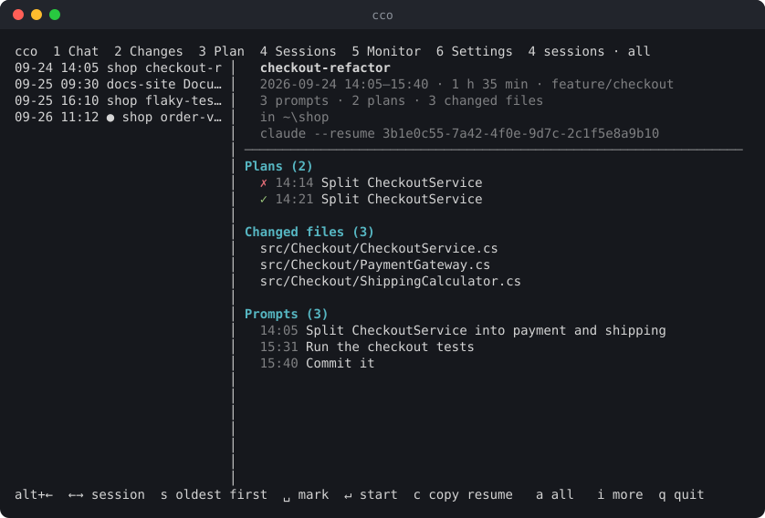
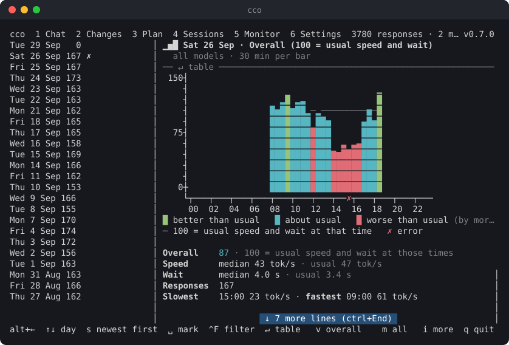

# cc-outline

[](https://github.com/hopp1395/cc-outline/actions/workflows/ci.yml)
[](https://www.npmjs.com/package/cc-outline)
[](https://www.npmjs.com/package/cc-outline)
[](LICENSE)

`cc-outline` (command `cco`) is a terminal viewer for Claude Code that runs in a split pane next to it, in Windows Terminal or tmux. It has six views:

- **Chat** renders the answers of the current session as proper Markdown: headings, lists, tables and code blocks with syntax highlighting. It follows the session live.
- **Changes** lists the files changed in the git repository and shows their diffs with syntax highlighting.
- **Plan** shows the plans Claude presented in plan mode, with their status and what changed between versions.
- **Sessions** gives an overview of your sessions across all projects: when, where, how long, which plans and which changed files. From there a session continues in a new terminal tab, or goes to the trash.
- **Monitor** charts how fast Claude answered over the day: output tokens per second, the wait for the first block and the number of responses, compared with the usual values at that time, plus errors such as usage limits.
- **Settings** lists all options in one place: whether the viewer opens by itself when Claude Code starts, and the display options of the other views.


## Why

Working with Claude Code in the terminal has four blind spots. cc-outline fills them without leaving the terminal and without interrupting Claude.

### 1. Answers are hard to read and quickly gone

**The problem.** Claude answers in Markdown, but the terminal shows much of it as plain text. Tables lose their shape, and headings and emphasis blend into the text. A plan with several steps looks like a wall of text. Long answers scroll past while Claude keeps working. To read an earlier answer again you scroll back through tool calls and output, and the prompt that answer belongs to is somewhere above it.

**How cc-outline solves it.** The Chat view renders each answer as Markdown, with real tables, headings, lists and highlighted code. The session is organised by prompt: every prompt is one entry in a list. Select one and you see exactly its answer, with the prompt pinned above it and tool noise hidden. The view follows the running session live and stays at the bottom like Claude Code. You can scroll up at any time without losing your place, and each turn remembers where you left it. Important answers can be marked with `Space` and found again after a restart.

### 2. You don't see what Claude changed

**The problem.** Claude edits files as it goes. The terminal only shows short summaries such as "Updated with 10 additions and 1 removal". To review the actual change you open an editor or run `git diff` in another window, and then find your way back to the conversation. Claude often touches several files, so reviewing them costs time and focus. Changes also get accepted without a real look.

**How cc-outline solves it.** The Changes view lists every changed file of the repository: modified, added, deleted and untracked. It shows each diff with line numbers and syntax highlighting, right next to the conversation that caused it. It refreshes every two seconds while Claude works, so you watch the changes appear. You can jump between hunks or open the whole file as it is now. The branch shows at a glance how many commits are waiting to be pushed or pulled.

### 3. Plans get lost once work starts

**The problem.** In plan mode Claude writes a plan and asks for approval. Once you approve it, Claude starts working and the plan scrolls away under tool calls and output. To check what was agreed, or whether a step was skipped, you have to scroll back and find it. If you reject a plan with feedback, Claude writes a new version, and nothing shows what changed compared with the one you rejected. Which versions were approved or rejected, and why, is hard to reconstruct later.

**How cc-outline solves it.** The Plan view lists every plan of the session with its time, title and status: approved, rejected or waiting for your decision. The selected plan stays readable next to the session while Claude carries it out, with the prompt it answers pinned above it, and for a rejected plan your feedback. `Enter` shows what changed compared with the previous version as a diff, so you only review the changes. Plans appear as soon as Claude writes them, before they are presented and before you decide, and can be marked like answers and files.

### 4. Past sessions are hard to find, resume and clean up

**The problem.** Every session is kept, in every project, but only as JSONL files with random names. `/resume` offers them by title and time. What a session was about, which plans it had and which files it changed only shows once you resume it, and that takes you out of the session you are in. Nothing deletes old or failed sessions, so the list only grows.

**How cc-outline solves it.** The Sessions view lists the sessions of all projects with their project, name and time. For the selected session it shows when and where it ran and for how long, on which branch, its plans with their status, the subagents it started, the files it changed and its prompts, all without resuming it. `Enter` continues it in a new terminal tab in the right folder, and `c` copies the `claude --resume` command instead. Sessions you no longer need go to a trash with `d`, where they can be restored until you delete them for good.

### In daily work

- **Review while Claude works.** Keep the approved plan in the Plan view and check the resulting diff in the Changes view, both next to the running session.
- **No context switch.** No editor, no second terminal, no `git diff`. One key (`1`–`6`) switches views, `alt+←` returns to Claude Code.
- **Better answers stay useful.** Tables, code and step-by-step plans are readable, and you can copy an answer's Markdown with `c` for a ticket, a PR description or documentation.
- **Long sessions stay navigable.** Prompts are listed with their time, prompts sent while Claude was busy are marked, and marked turns survive restarts, `--continue` and `/resume`.
- **Pick up older work.** Find yesterday's session in the Sessions view by its plans and changed files, and continue it in a terminal window of its own.
- **Everything stays where you left it.** Every list keeps its selected entry and each entry's scroll position, also across restarts.
- **Nothing to manage.** The plugin opens the pane with `/cco:chat`, `/cco:git`, `/cco:plan`, `/cco:session`, `/cco:settings` or `/cco:monitor`, follows the active session, closes it with the session and opens it again on every start (with *auto open* set to `remember`: only if it was open).
- **Set up once, in one place.** The Settings view (`6` or `/cco:settings`) lists every option with its default: whether the viewer opens by itself, whether quitting asks first, whether long entries scroll and positions are remembered, and the display options of the other views. A change applies at once in all views and all projects.

## Installation

Requirements:
- Node.js 22 or later
- Claude Code
- Windows Terminal or tmux, to open the viewer in a split pane

**1. Install the CLI:**

```sh
npm install -g cc-outline
cco --version
```

**2. Install the Claude Code plugin.** It provides the hooks and the `/cco:chat`, `/cco:git`, `/cco:plan`, `/cco:session`, `/cco:settings`, `/cco:monitor`, `/cco:releases`, `/cco:update`, `/cco:restart` and `/cco:doctor` commands. The npm package is its own plugin marketplace:

```sh
claude plugin marketplace add "$(npm root -g)/cc-outline"
claude plugin install cco@cc-outline
```

**3. Restart Claude Code**, then run `/cco:chat`, `/cco:git`, `/cco:plan`, `/cco:session`, `/cco:settings` or `/cco:monitor`. The viewer then opens on every start; set *auto open* to `remember` or `never` in the Settings view to change that.

**Updating.** When a new version is out, the top bar shows it (`v0.7.0 → 0.8.0`, in narrow panes `↑ 0.8.0`) and the *Releases* entries in the Settings view (`/cco:releases`) show its release notes; `Enter` on *update to v0.8.0* (or `/cco:update`, which checks right away and asks) runs the three commands below, then the viewer opens again with the new version (see [Settings view](#settings-view)). By hand: update the CLI and the plugin, then restart Claude Code. New commands such as `/cco:settings` only appear after the plugin update:

```sh
npm install -g cc-outline
claude plugin marketplace update cc-outline
claude plugin update cco@cc-outline
```

**When something does not work** (the viewer does not open on start, `/cco:…` takes seconds, a pane opens as a window), run `cco doctor`, see [Usage](#usage).

To uninstall, run `claude plugin uninstall cco@cc-outline`, `claude plugin marketplace remove cc-outline` and `npm rm -g cc-outline`, then delete `~/.claude/cco/`.

### From source

```sh
npm install
npm run build
npm link            # makes `cco` available globally
claude plugin marketplace add <path-to-this-repo>
claude plugin install cco@cc-outline
```

To load the plugin for a single session without installing it, run `claude --plugin-dir ./plugin` instead.

## Usage

- **`/cco:chat`**, **`/cco:git`**, **`/cco:plan`**, **`/cco:session`**, **`/cco:settings`** or **`/cco:monitor`** in Claude Code opens the viewer in a split pane (Windows Terminal or tmux), starting in that view. If a viewer is already running for the project, the command switches it to that view instead of opening a second pane. **`/cco:releases`** opens the Settings view on the release notes and the update, if one is out. **`/cco:update`** checks for a new version right away, also with the setting *update* off, and asks in the Settings view whether to install it. **`/cco:restart`** closes the viewer and opens it again in the same place and view with the version installed now; if none runs, it opens one.
- **Where it opens:** docked right of Claude Code (default), docked left, or in a window of its own, as the *placement* setting says. `p` in the viewer moves it: `1` right, `2` left, `3` window. The viewer closes and reopens there, keeping its selection and scroll positions, and the session remembers the place for the next time it opens (on start, `/resume` in a new Claude Code, `/cco:…`). A window takes the keyboard focus from Claude Code, also when it opens on start, since Windows Terminal cannot hand the focus back to another window. In tmux, *window* is a tmux window. A `/cco:…` command typed while Claude is working only runs when the turn ends; by then you may be in another tab, and Windows Terminal can only split the tab that is active then, so in that case the viewer opens in a window of its own (tmux still splits Claude Code's pane), and `p` docks it. A viewer that already runs stays where it is when you change the setting or `/resume` another session.
- **`cco`** (or `cco watch`) in a project directory starts the viewer by hand, in any terminal:
  - `--cwd <dir>`: the project whose session is shown
  - `--session <id>`: show this session instead of the active one
  - `--view chat|git|plan|sessions|settings|monitor`: view to start with (default: the session's last view, see *view per session*, else `chat`)

  A viewer started this way follows the project's latest session. To tie it to one Claude Code instead, select a session running in it in the Sessions view and press `Enter` (`↵ attach`), see [Sessions](#sessions-view).
- **`cco open`** opens the viewer next to the current pane like the `/cco:…` commands, with `--view` and `--placement right|left|window` (default: the session's placement, else the setting).
- **`cco doctor`** checks what cco needs and prints a report, one line per check (`✓` fine, `!` worth a look, `✗` error), with what to do below each problem:
  - *Installation:* npm install or checkout, the path the plugin starts cco by (`~/.claude/cco/cli.json`), whether the plugin `cco@cc-outline` is installed and enabled, and whether its version matches the CLI.
  - *State files* in `~/.claude/cco/` of all projects: those of Claude Code processes and viewers that have ended, unfinished writes (`*.tmp`), debug logs, files that are no valid JSON, records of sessions that ended over a day ago, the restore state of projects without transcripts, and trash folders without a readable manifest. Marks, positions and views are never touched.
  - *Settings:* values of the wrong type or unknown, unknown keys and old formats in `settings.json`.
  - *Environment:* Node version, Claude Code's folder (`CLAUDE_CONFIG_DIR`), and the terminal (Windows Terminal, also without `WT_SESSION`, or tmux).
  - *Hooks:* while a Claude Code runs in the project (`--cwd`, default: the current folder), whether the plugin's hooks recorded its last prompt.

  It exits with 1 if an error is found. `--fix` repairs without asking what it can: deletes or renames (`.corrupt`) the state files above, records the CLI's path, rewrites `settings.json` with the values that apply, and for an npm install updates an older plugin (`claude plugin marketplace update`, `claude plugin update`; restart Claude Code afterwards). Then it checks again. **`/cco:doctor`** shows the report in Claude Code, and *doctor* in the Settings view's Reset group checks and repairs, each after asking.

All views share one layout:
- **Top bar:** the view tabs, a status summary and, on the right if there is room, the version of cc-outline. Options that are on are not repeated there; the help line highlights them.
- **Body:** a list on the left and a preview on the right. When the preview is longer than the pane, its first or last row becomes a blue badge that says how many lines are hidden above (`↑ 5 more lines (ctrl+Home)`) or below (`↓ 15 more lines (ctrl+End)`), with the key that jumps there; a click on the badge jumps as well. In a narrow preview the key is left out. A scroll bar on its right edge shows which part is in view: the thumb touches the top or bottom of the track only when the preview is at its very top or end. A click on the bar jumps there. The status in the top bar names the position: `top`, `end`, the lines in view in between (`121–160/300`), or `all` when everything fits.
- **Help line:** the keys of the current view at the bottom.

The viewer sets the terminal title to the session title, the one set with `/rename` or else the one Claude Code gave the session; until the session has one, the project folder. So its tab, and a window of its own in the taskbar, show which session it follows instead of just `cco`. Like Claude Code, the title starts with a status mark: `◐` and `◑` in turn while Claude works on the last turn, `✳` when it waits for you. A viewer opened with `--session` shows no mark. A Windows Terminal profile with `suppressApplicationTitle` keeps `cco`.

Press `1` to `6` to switch between the views, or `Tab` and `Shift+Tab` for the next and previous one (hidden views are skipped). All of them keep running in the background, so the chat keeps following the session while you look at the changes.

**Lists.** All lists work the same way:
- `↑`/`↓` select the previous or next entry, `Home`/`End` the first or last one. The preview next to the list scrolls by page with `PgUp`/`PgDn` and by line with `Ctrl+↑`/`Ctrl+↓`; `Ctrl+Home`/`Ctrl+End` go to its top and bottom. `←`/`→` do nothing.
- Chat and Plan show the oldest entry at the top; `s` turns the list around and remembers it (the *order* settings). Sessions (with its trash) and Monitor always show the newest at the top. The keys follow what you see: `↑`/`↓` go up and down, `Home`/`g` to the top, `End`/`G` to the bottom; in the chat, whichever of them reaches the newest turn resumes follow mode.
- If the text of the selected entry (prompt, file path, plan or session name) is too long for the list, it scrolls: at most 250 characters, then it starts over from the beginning. The other entries are cut with `…`. The Settings view switches this off.
- If the list is longer than the pane, its first or last row shows how many entries are hidden above (`▲ 12 more Home`) or below (`▼ 5 more End`), together with the key that jumps there.
- Chat, Plan and Sessions (with its trash) show only the time of an entry; a dimmed line with the date (`── Mon 28 Sep 2026 ──`) starts each day, above its entries in either order. A list whose entries are all from today has none. The *date separators* setting turns the lines off. The lines cannot be selected (a click on one selects the day's first entry), and when the day's line has scrolled away, the `▲` row names the day (`▲ 12 more · Mon 28 Sep Home`). In a session's preview, plans, agents and prompts get these lines if the session spans several days. The Monitor's list of days gets a line per year (`── 2025 ──`) once it reaches into another year.
- **Mouse:** a click on a tab in the top bar switches to its view, a click in a list selects an entry, a double click does what `Enter` does (in every view; a confirmation still asks first), the wheel moves to the previous or next one. `↓ more ↓` loads with a single click. In the preview the wheel scrolls, and a click on a web address (`https://…`, also one wrapped over two lines) opens it in the browser when you let go. Dragging in the preview selects text in the preview only, not the list beside it, and copies it when you let go (`copied 4 lines`); dragging past the top or bottom scrolls on. The header above it (the prompt in the chat, the path in Changes) selects the same way, on its own and without the `❯` in front. A selection that starts right of the line numbers (Changes) leaves them out. A click or the right mouse button drops it. To select across the whole pane as the terminal does, hold `Shift` while dragging. The *mouse* setting turns this off.
- `Space` marks the selected entry as a favourite (`★` at the start of its row) or removes the mark. `Shift+↑` and `Shift+↓` jump to the previous and next marked entry, and the top bar counts them (`★ 2`).
- With the *pinned group* setting (off by default), every list but the trash shows its marked entries once more at the top, under `── ★ Pinned ──`, in the list's order, and below a plain line (or the first date separator) the whole list, where they keep their place without the `★`. `↑`/`↓`, `Home`/`End` and the wheel follow the rows on screen, through both copies; `Shift+↑`/`↓` steps through the pinned rows (from the list below, up to the last one). Following (Chat, Plan) and a restored selection go to the entry's place in the list. Marking or unmarking an entry in the list keeps the selection there; unmarking a pinned row selects the next pinned one (after the last, the one above), and the only one stays selected in its place in the list. A filter applies to the group too, and Sessions and the Monitor pin only what their range has read.
- `Ctrl+F` filters the list. A dialog opens; the list shrinks while you type and the dialog counts the matches (`12 of 340`). `Enter` keeps the filter, `Esc` drops it; `↑`/`↓` and the wheel select in the filtered list meanwhile. While a filter is on, the list's top row shows it (`⌕ plan*view · 12 of 340 · ^F clear`) and the top bar counts `12/340`; `Ctrl+F` again drops it, and the next `Ctrl+F` offers it again (selected: type to replace it, `→` to add to it). Case does not matter, every word must occur (in any order), `*` stands for any text and `?` or `_` for one character. The dialog's `[x] in the list` (`^L`) and `[x] in the details` (`^D`) choose where it looks; the choice is kept as the *filter in* setting (default: the list only). The list is what a row shows: the prompt (Chat), the path (Changes), the plan's title (Plan), the title and project (Sessions), the date written several ways and the weekday (Monitor), value, group and name (Settings). The details are what the preview adds: attached files and subagents (Chat), the former path and the status (Changes), the plan text, status and feedback (Plan), folder, branch, id, prompts, changed files, plans and agents (Sessions), the models of the day (Monitor), the description (Settings). Each view keeps its filter while the viewer runs; the trash has none. Following (Chat, Plan) goes to the newest entry that matches, and `Shift+↑`/`↓` jump only between marked entries that are shown.
- Marks are saved per project in `~/.claude/cco/<project-slug>.favorites.json`: turns by prompt, files by path, plans by their id, sessions by their id, Monitor days by their date. The settings are global, and so are their marks, in `~/.claude/cco/favorites.json`.
- Every list remembers its selected entry, and the preview remembers its scroll position for each entry: switch to another entry and back, and you are where you left it. Detail views keep their own position (the whole file of a changed file, the changes to a plan's previous version). Both survive closing and reopening the viewer; they are saved per project in `~/.claude/cco/<project-slug>.positions.json`. A list that was following the newest entry (Chat, Plan) follows it again. With *remember positions* off in the Settings view, they are kept only while the viewer runs.

## Chat view

The Chat view shows the session turn by turn. A turn is one prompt plus everything Claude answered to it.


**List (left).** One entry per prompt, with its time.
- Slash commands appear as `/name args`, with the command's name in orange in the list and above the answer, shell commands run with `!` as `! command`, with their output as the answer. Claude Code writes a `!` command to the transcript only when it has ended, so it shows up then.
- Side questions asked with `/btw` do not show up: Claude Code keeps them in memory only and writes neither the question nor the answer to the transcript.
- A prompt of pasted images only appears as `[Image]` or `[3 images]`.
- Browser calls (Claude in Chrome, and the Browser pane of the Claude desktop app) show one line per browser action, verb first: `↗ navigate example.com/…`, `⊙ click (451, 265)`, `⌨ type "…"`, `▣ screenshot · 1568×744`, `⌕ browser find "…" → 2 elements`, `⇄ browser network`; a browser batch lists its actions below it. A dimmed line names the page whenever it changes (`on CloudWatch | eu-central-1`). At *full*, scripts, search results and console messages follow. Screenshots are numbered through the turn, `[▣ 3]` after the action that took them (a scroll or click can bring one too): a click on the mark opens it in the system's image viewer, `o` opens the last one (unless the prompt has images of its own) and `O` lists them all with their action and page. The image is the copy the desktop app saved next to the transcript, otherwise the image data from the transcript, written to a temporary folder.
- **Subagents.** Where Claude starts a subagent, the answer shows it as a block: `◆ Explore · Map the order flow · sonnet · background`, below it its status (`⠿ running`, spinning, then `✓ completed · 1 min 13 s · 12 tool uses · 41k tokens`, or `✗ failed`). In the list, `◆2` marks a turn that started two subagents, and the spinner stays while background agents of that turn still run. `a` shows what the turn's subagent did instead of the answer: its task and its answers, with tool calls and thinking as `t` and `h` say, read live from its own transcript in `~/.claude/projects/<project-slug>/<session-id>/subagents/`. With several agents, `a` goes on to the next one and `A` back to the previous one, past the last or first back to the answer; `Esc` goes back at once. `↑`/`↓` switch turns as always, which closes the agent's page. When a background agent hands its report back, the report gets a turn of its own (`↩ Agent "…" reported back`, magenta): the report comes first with a magenta bar, then Claude's reaction to it. `a` shows it as the agent's result too. The Settings view hides the blocks (*Chat: agents*).
- When a background agent or command stops, Claude Code reports it to Claude. That report becomes an entry of its own, marked `↩` (green when it completed, red when it failed), with Claude's reaction as its answer. `Enter` shows what the task returned.
- What came with a prompt is named in a line below it: `📎 2 images · @src/Order.cs · 12 lines selected in Foo.cs` (pasted images, files and folders mentioned with `@`, lines selected in the IDE or a diff). `Enter` lists them below the full prompt, with where each image is stored. `o` opens the turn's images in the system's image viewer: the copies Claude Code keeps in `~/.claude/uploads`, or, when those are gone, the image data from the transcript, written to a temporary folder. Files Claude Code attaches again after `/compact` are not the user's and are left out.
- `/compact` shows the summary Claude Code compacted the conversation into as its answer, under a heading with the tokens before and after and how long it took. An automatic compaction gets an entry of its own, `⟳ Conversation compacted automatically`, with Claude's work after it.
- When you come back after a while, Claude Code writes a recap of the session. The chat shows it below the answer it follows, set apart with a yellow bar and `※ Recap`.
- `/compact` can move the session to a new transcript, for example when it sends the session to the background. The viewer then reads on in that transcript, so the chat keeps the turns so far and shows what follows. Where it went on, the list has an entry of its own, `⤷ Session continues in …`: its details name both sessions, the compaction (tokens before and after, how long it took), whether the session was sent to the background, and the command to resume it; Claude's answers after the switch belong to it. Opened on the new transcript later, for example after `/resume`, it reads the earlier one first. The Sessions view shows both as one session, resumed under the newer id.
- Prompts you sent while Claude was still working are marked with `↳`. Claude Code stores these separately; cc-outline shows them as turns of their own.
- The turn Claude is working on has a spinning `⠋` in front of it, and its answer ends with `Claude is working…` until Claude finishes. With tool calls off, that line counts the turn's calls so far (`Claude is working… · 12 tool calls`), so you can see it getting on. A turn you stopped with `Esc` in Claude Code is marked with a red `⊘`, and its answer ends with `⊘ Interrupted by user` (or `… during a tool call`).
- Turns keep their marks across restarts and when you continue a session with `--continue` or `/resume`, which starts a new session id but keeps the turns.

**Prompt (top right).** The selected prompt stays pinned above the answer while you scroll.
- It shows at most 1000 characters and never more than half the pane height.
- If it is cut, the separator reads `↵ full prompt`. Press `Enter` to read the whole prompt, then `Enter` or `Esc` to return to the answer.
- Below it, marked with `$` like the prompt with `❯`, what the turn took: `2 min 14 s · ↓ 3.2k · ctx 84k · opus-5.5 · 12 tools · + ◆2 58k`. That is how long it ran (counting up while Claude works), the tokens Claude wrote (thinking included), how full the context was at its end, the models, the tool calls and the subagents it started with their tokens. A second line counts the files it created and changed and their lines: `files +2 ~5 · lines +184 −37`. Files deleted with a shell command are not counted, nor what subagents wrote. Turns without an answer from Claude (`!` commands, `/rename`) have no such line. Parts that do not fit the pane width are left out from the end.

**Answer.** The answer is rendered as Markdown and wrapped to the pane width. List items keep their indentation when they wrap.

- **Browser.** With tools `off`, what Claude did in the browser still shows, in a cyan frame (`╭─ Claude in Chrome · 6 actions · 2 screenshots`, `Browser` for the desktop app's pane): one line per action as above, the page in between, and below an action what it found, dimmed and at most five lines: the elements a search matched, a script's value of several lines, console messages. Claude's text between the actions starts a new frame; tool calls hidden with `off` do not. `c` leaves the frames out.
- **Questions.** When Claude asks you something (a multiple-choice question in Claude Code), the answer shows it in a yellow frame (`╭─ Claude asks`). Each question starts with a yellow badge (its number and header, e.g. `1/4 Focus`), then its options: the one you chose marked `●` in green, the others dimmed `○`. Below, your answer in green as `┃ You: …` (`(own answer)` when you typed it, and your note if you added one). A dimmed line separates the questions. The frame is only for tools `off` (`t`), so questions show even then; with `compact` and `full` a question is a tool call like the others: `⚙ AskUserQuestion` with the question and your answer, in `full` each question with its answer below.
- **Tool calls.** `t` steps through three levels:
  - *off* (default): no tool calls.
  - *compact*: one line each, with its result: `⚙ Read src/open.ts · lines 85–145 of 300`, `⚙ Edit src/open.ts · +12 −3`, `⚙ Bash Run the tests · ✓ · 14 lines`, `⚙ Grep TODO in src · 3 files`, `▤ Plan presented → approved`. `✗` marks a tool that failed, `⊘ denied` one you rejected.
  - *full*: also the command, the last 10 lines of its output, the files found and the pages a web search returned.

  Claude Code writes a tool call to the transcript only once it has finished, so a call shows up together with its result: a question appears when you have answered it.
- Tool calls (`t`) and thinking blocks (`h`) are hidden by default.
- With `w`, wrapping is switched off: paragraphs and code lines stay whole, and `Ctrl+←/→` scrolls sideways.
- `c` copies the turn's Markdown (without tools and thinking) to the clipboard.

**Follow mode** is on by default.
- The newest turn is selected, and the view sticks to the bottom while the answer grows, like in Claude Code.
- Scrolling up or selecting an older turn leaves follow mode. The badge `↓ 15 more lines (ctrl+End)` at the bottom of the preview then shows how much is left below; `Ctrl+End` or a click on it goes there. Scrolling back down to the end, `↓` to the newest turn, `Ctrl+End` or `G` resumes following. `f` toggles follow mode directly.
- Each turn remembers where you left it scrolled. An older turn that is not scrolled to its end also shows the badge; there `Ctrl+End` jumps to the end of that answer.

**Status.** The top bar shows:
- the session id
- the number of turns
- the scroll position (`top`, `end`, the lines in view such as `121–160/300`, or `all`)
- the number of marked turns (`★ 2`)
- with wrapping off, how far the answer is scrolled sideways (`→ 16 cols`)

Which options are on (`f follow`, `t tools`, `h think`, `w wrap`) shows in the help line at the bottom, where they are highlighted.

The viewer switches sessions automatically after `/clear` or `/resume`.

## Changes view

The Changes view shows what Claude has changed in the working tree, compared with `HEAD`.


**List (left).** One entry per changed file, with its status and line counts. A marked file keeps its mark by path, also after it was committed and changed again. The statuses:
- `M` modified, `A` added, `D` deleted, `R` renamed, `C` copied, `U` conflict
- `?` untracked, counted as all-added lines

**File header (top right).** It stays in place while you scroll, like the prompt in the Chat view. It shows:
- the full path, wrapped at `/`
- the status, the line counts and the current mode (`diff` or `whole file`)
- for renames, the old path

**Diff.** Each hunk starts with its `@@` header.
- Every line shows its old and new line number, a `+`/`-` sign and a colored background for added and removed lines.
- `]` and `[` jump to the next and previous hunk.
- Repositories without any commit are diffed against the empty tree.
- Binary files are only named.

**Whole file.** `Ctrl+Enter` switches to the complete file as it is now, with line numbers and highlighting but without change markers. There, `]` and `[` jump between the changed blocks. `Ctrl+Enter` or `Esc` returns to the diff. Deleted files have no content after the change, so the view says so.

**Opening.** `Enter` or a double click on a file in the list opens it as it is now in the app the system uses for its type (via `explorer.exe`, `open` or `xdg-open`). Deleted files cannot be opened. In tmux, `Ctrl+Enter` only arrives with `extended-keys` on.

**Wrapping.** Long lines wrap by default. After `w`, lines stay whole and `Ctrl+←/→` scrolls sideways in steps of 8 columns. The line numbers and hunk headers stay in place.

**Status.** The top bar shows the current branch, the files and line counts, and the scroll position. If the branch has an upstream, `↑` is followed by the number of outgoing commits (not yet pushed) and `↓` by the number of incoming ones (not yet pulled), e.g. `main ↑2 ↓1`. Non-zero counts are highlighted. cc-outline never fetches, so the incoming count is as of your last `git fetch` or `git pull`.

**Refresh.** While the view is visible, it re-reads git every 2 seconds; `F5` refreshes at once and also finds a repository created since (`git init`). The selected file stays selected as long as it is still changed.

**Syntax highlighting** exists so far for C# (`.cs`, `.csx`). Add more languages through the `LANGUAGES` map in `src/render/diff.ts`.

## Plan view

In plan mode (`Shift+Tab` in Claude Code), Claude first writes a plan and asks for approval. When you ask for changes, it writes a new version. The Plan view keeps every plan of the session.


**List (left).** One entry per plan, with its time, its title (the first heading) and its status:
- `✓` approved
- `✗` rejected
- `●` waiting for your decision
- `✎` being written: Claude is still in plan mode and has not presented it yet

**Plan (right).** The selected plan rendered as Markdown. Above it, pinned while you scroll:
- the title
- the version, status and time (`v2 · approved · 11:15`)
- the prompt the plan answers
- your feedback, if you rejected it with a comment

**Changes between versions.** If there is an earlier version, the separator below the header reads `↵ changes to v1`. `Enter` then shows what changed compared with that version, as a diff with line numbers. `Enter` or `Esc` returns to the plan.

**Following.** The newest plan stays selected while Claude presents new ones; selecting an older plan stops that, and `End` resumes it.

**While Claude writes.** A plan shows up as soon as Claude writes it, not only once it is presented. Claude Code records the presented plan in the transcript only after you decided; but when plan mode starts it names the plan file (in `~/.claude/plans/`), and Claude writes the plan there first. The Plan view shows that file as `✎` and updates it while Claude revises it. Once the plan is presented and you decide, it becomes a regular entry (`✓`/`✗`); after a rejection, the next revision shows up as `✎` again, and `Enter` shows what it changes. `c` copies the plan's Markdown.

**Wrapping.** Long lines wrap by default. After `w`, lines stay whole and `Ctrl+←/→` scrolls sideways; in the changes between versions the line numbers stay in place.

**Status.** The top bar shows:
- the number of plans, and how many are approved, rejected and waiting
- the scroll position
- the number of marked plans (`★ 2`)
- with wrapping off, how far the plan is scrolled sideways (`→ 16 cols`)

The help line highlights `w wrap` while wrapping is on and `End follow` while the newest plan is followed.

## Sessions view

The Sessions view is an overview of your Claude Code sessions: of all projects by default, or only of this one after `a` (remembered in `settings.json`). It only reads them: the other views keep showing the active session.



**List (left).** One entry per session, the one you last asked Claude something in first, with the time of that question (under a line per day; slash and `!` commands don't count, and a session without a question counts from its last entry). A long session or one continued with `/resume` comes up again when you ask it something, not merely while Claude works in it. Each row shows, with all projects, the project's folder name and then the session's name: the name given with `/rename` (bright), otherwise its first prompt (dim and in quotes, „like this“). The active session is marked with a green `●`, sessions running in another Claude Code with `▶`. While Claude works in one of them, its mark blinks; while it waits for you (a permission, a question), the mark is yellow. The preview's header says `working` or `waiting for input`. Both come from the status Claude Code writes to `~/.claude/sessions/` (version 2.1.283 on), read every second. Sessions that only ran slash commands such as `/resume` or `!` commands and changed nothing are left out.

**Range.** The list holds the sessions you asked something in the last 7 days (the *Sessions: range* setting: today, 7, 30 or 90 days, or unlimited; days count from midnight, today included). The active session and sessions running elsewhere are listed even if that was earlier. The last entry, `↓ more ↓` (centred, blue like the previews' "more lines"), reads the whole history with `Enter` or a click (`↓ loading… 42/97 ↓` meanwhile) and then goes; that holds until the viewer restarts, also if the setting changes. Transcripts last written before the range are not read at all, so a short range is quicker. A filter never hides it.

**Details (right).** Pinned at the top:
- the name
- the date, start and end time, duration and git branch
- the number of prompts, plans, subagents and changed files
- the folder the session ran in, where the resume command has to be run
- the command that continues the session: `claude --resume <session-id>`. `c` copies it to the clipboard. In a running Claude Code, `/resume <session-id>` does the same.

Below it:
- **Plans** with their status (`✓` approved, `✗` rejected, `●` waiting), time and title
- **Agents** (only if the session started any): the subagents with their status (`✓` completed, `✗` failed, `⠿` running), start time, type, task and duration
- **Changed files**: every file Claude edited or wrote. Files of the project come first, relative to it; files elsewhere (such as plan files) are dimmed.
- **Prompts** with their time. Reports of background tasks (`↩` in the chat) are not counted as prompts.

**Refresh.** Sessions are read when the view is first shown and re-read every 3 seconds while it is visible. The first read fills the list as it goes (`reading 42/97` in the top bar); with many projects it takes a few seconds. After that only files that changed are read again, and of those only the part that was appended. Only what the overview shows is kept in memory, not the answers.

**Enter: attach, resume, detach.** `Enter` (or a double click) on a session always opens the same dialog: the actions that make sense for it, the usual one selected (`↑`/`↓` and `Enter`, or its number; `Esc` cancels), the others greyed out with the reason they cannot be chosen now. The help line names the action selected (`↵ switch`, `↵ attach`, `↵ resume here`, `↵ new window`, `↵ start + attach`, `↵ copy`). A viewer *attached* to a Claude Code is one opened by a `/cco:…` command or on start, or attached later; one started by hand (`cco watch`) is *detached* and follows the project's latest session. Only one viewer runs per Claude Code: `cco watch --claude-pid` refuses to start a second.

| The session | Viewer attached | Viewer detached |
|---|---|---|
| the viewer's own | **Stay attached** · Detach the viewer | (as any other) |
| runs in another Claude Code | **Switch to its tab** · Attach the viewer there | **Attach the viewer** · Switch to its tab |
| runs nowhere | Continue it here · **Continue it in a new window** · New window and attach | **Start it and attach the viewer** · Only start it |

Every dialog ends with *Copy the command* (`claude --resume <session-id>`, for a background session of the Claude Code daemon `claude attach <id>`), which is selected when nothing else can be done: without Windows Terminal or tmux there is no tab to switch to and no window to open, and a session whose folder is gone cannot be continued.

- *Detach the viewer*: it stays open, now detached, and follows the project's latest session; `/cco:…` in its former Claude Code opens a new viewer. *Stay attached* is selected, so `Enter` twice changes nothing.
- *Switch to its tab* brings the tab the session runs in to the front: in tmux its pane, in Windows Terminal the tab titled with the session's name (it takes a second or two; with two tabs of the same name, nothing is switched). A background session without a tab says to use `claude attach <id>`.
- *Attach the viewer (there)*: the viewer stays where it is, switches to that session's project and shows its chat, follows it like a viewer opened with `/cco:chat` (also after `/clear` and `/resume`), and closes when that Claude Code ends; its `/cco:…` commands then use this viewer. An attached viewer leaves its former Claude Code without one. Not on offer when that Claude Code has a viewer of its own.
- *Continue it here*: in the Claude Code the viewer belongs to, with `/resume <session-id>`. The command is typed in for you, after clearing whatever was typed there: in tmux into its pane, on Windows into its console (which tab or pane has the focus does not matter). Where that does not work, it is copied instead and the focus moves to Claude Code's pane next to the viewer, so `Ctrl+V` and `Enter` continue it. Selected when that Claude Code has no prompt yet (a `/clear` at the start does not count), and not on offer while Claude works or waits for an answer, or for a session of another project folder (`/resume` only finds the sessions of the folder Claude Code was started in). The viewer then follows the session as after a `/resume` typed by hand.
- *Continue it in a new window* / *Only start it*: a new Windows Terminal window (or a new tmux window), in the folder it ran in, with `claude --resume <session-id>`. The shell stays open when Claude Code exits. The viewer stays as it is; the new Claude Code opens a viewer of its own if the *auto open* setting says so.
- *New window and attach* / *Start it and attach the viewer*: the same, then the dialog waits for its Claude Code (`Waiting for Claude Code… 4/30 s`, `Esc` stops waiting); that Claude Code opens no viewer of its own, and once it runs, the viewer moves next to it as the *placement* setting says and shows its chat. If it does not show up within 30 seconds, the viewer stays as it was, and the started Claude Code keeps running.

**Deleting.** Claude Code has no command to delete a session; cc-outline moves it to a trash of its own first.
- `d` (or `Del`) moves the selected session to the trash, after a confirmation. It then disappears from the list and from `/resume`. `u` right afterwards undoes it.
- Moved are the transcript, the session's folder next to it (subagents, title), its file history for `/rewind` and its session environment. The shared prompt history (`history.jsonl`) and plan files in `~/.claude/plans/` stay.
- The active session and sessions running in another Claude Code (per `~/.claude/sessions/`) can't be deleted.
- `T` shows the trash, of all projects or of this one like the list, most recently deleted first, with the details as before. There, `u` restores the selected session, `x` deletes it for good and `X` empties the trash, each after a confirmation. `T` or `Esc` returns to the list.
- In the confirmation, `Enter` means yes and `Esc` means no. While it is open, no other key does anything.
- The trash lives in `~/.claude/cco/trash/<project-slug>/`, per project of the session. A session stays there until it is deleted for good; restoring is refused if the session exists again in the meantime.

## Monitor view

The Monitor view (`5`, or `/cco:monitor`) shows how Claude Code answered over a day, from the transcripts of all projects, subagents included.



**List (left).** Every day with responses in the last 7 days (the *Monitor: range* setting, like in Sessions), newest first, with how many; today leads. The last entry, `↓ more ↓`, reads the whole history with `Enter` or a click. The usual values come from the days read, so a short range has fewer of them. `✗` marks a day with errors. Like every list, `Space` marks a day (`★`), for example one with a slump to come back to, and `Shift+↑`/`↓` jump between marked days.

**Chart (right).** One bar per stretch of the day, as fine as the pane allows (5 to 60 minutes), with a y axis and the hours below:
- `v` switches the value: **overall** (see below; the chart starts with it), **speed** (output tokens per second of a response, median per stretch), **wait** (seconds until its first block was finished; an upper bound of the time to the first token) and **responses** (how many started).
- **Overall** is an index of speed and wait together against the usual values at that time: 100 is usual, higher is better. It is the geometric mean of speed / usual speed and usual wait / wait, so twice as fast counts as much as half the wait. The day's index weighs each stretch by its timed responses.
- A dimmed `─` marks the usual value at that time of day: the median of the 30 days before (for overall: 100). Bars more than 15 % worse than usual are red, more than 15 % better ones green, the rest cyan; a legend below the chart says so.
- `✗` on the time axis marks an error Claude Code wrote into the transcript, such as a usage limit.
- `m` switches the model: all models (the start), then each model seen, the one used last first, since models differ in speed.

**Table.** `Enter` switches between the chart and a table of the day's raw data, and back: one row per response with its time, model, wait, how long it took, output tokens, speed and overall index against the usual values of its stretch, and the errors in between. Responses too short to time are dimmed. The header shows the day's overall index.

Below the chart: the day's overall index, median speed and wait against the usual values, the number of responses, the slowest and the fastest hour, and the errors with their time. Today's chart follows new answers every few seconds while the view is shown.

**Limits.** It measures only your own sessions, so it shows how fast Claude answered you, not the load of the service as a whole. Speed depends on the model, the effort and how much Claude thinks. Transient API errors (overloaded, rate limits, retries) appear only briefly in Claude Code and are not written to transcripts, so they are missing here.

## Settings view

The Settings view (`6`, or `/cco:settings`) lists every option under a line with its group (`── Chat ──`), with its value at the right end of the row; a name too long for the list is cut, never the value. The preview shows what it does, all possible values (the current one marked `●`, the default named) and the key that switches it in its own view. Values that differ from the default are yellow, and the top bar counts them.

| Setting | Values | Default | Also |
|---|---|---|---|
| Start: auto open | `remember` / `always` / `never` | `always` | – |
| Start: placement | `right` / `left` / `window` | `right` | `p` in any view |
| General: confirm quit | on / off | on | – |
| General: marquee (long list entries scroll) | on / off | on | – |
| General: date separators (a line per day in lists) | on / off | on | – |
| General: pinned group (marked entries at the top) | on / off | off | – |
| General: remember positions (across restarts) | on / off | on | – |
| General: view per session | on / off | on | – |
| General: mouse | on / off | on | – |
| General: update | on / off / auto | auto | – |
| Chat: tab | on / off | on | – |
| Chat: tool calls | off / compact / full | off | `t` in Chat |
| Chat: thinking | on / off | off | `h` in Chat |
| Chat: agents | on / off | on | – |
| Chat: wrap | on / off | on | `w` in Chat |
| Chat: order | oldest first / newest first | oldest first | `s` in Chat |
| Changes: tab | on / off | on | – |
| Changes: wrap | on / off | on | `w` in Changes |
| Plan: tab | on / off | on | – |
| Plan: wrap | on / off | on | `w` in Plan |
| Plan: order | oldest first / newest first | oldest first | `s` in Plan |
| Sessions: tab | on / off | on | – |
| Sessions: all projects | on / off | on | `a` in Sessions |
| Sessions: range | today / 7 days / 30 days / 90 days / unlimited | 7 days | – |
| Monitor: tab | on / off | on | – |
| Monitor: range | today / 7 days / 30 days / 90 days / unlimited | 7 days | – |

What they do:
- **auto open** decides whether the viewer opens by itself when Claude Code starts: only if it was open when Claude Code last exited in the project (`remember`), on every start in every project (`always`), or never (`never`). See [Opening on start](#how-it-works).
- **placement** is where the viewer opens for sessions that have no place of their own: docked right or left of Claude Code, or in a window. `p` in the viewer moves it and remembers the place for the session (see [Usage](#usage)).
- **confirm quit** makes `q` and `Esc` ask before the viewer closes.
- **marquee** lets the selected list entry scroll when it is too long; off, it is cut with `…` like the others.
- **date separators** puts a line with the date above each day's entries in Chat, Plan, Sessions and the trash, and one per year in the Monitor; off, Sessions and the trash show the date in each row again.
- **pinned group** moves the marked entries of every list (Chat, Changes, Plan, Sessions, Monitor, Settings) once more to the top, under `── ★ Pinned ──`, in the list's order, above the whole list; see [Lists](#usage).
- **remember positions** keeps the selected entries and scroll positions across restarts of the viewer; off, they are kept only while it runs.
- **mouse** lets the viewer take the mouse: a click on a web address in the preview opens it in the browser, a click in a list selects the entry, a double click does what `Enter` does, and the wheel scrolls the preview or, over the list, moves to the previous or next entry. While it is on, the terminal leaves clicks and drags to the viewer: a drag in the preview selects and copies its text, and `Shift`+drag selects the terminal's way (Windows Terminal). Off, the terminal keeps the mouse and opens addresses with `Ctrl`+click.
- **view per session** brings each session back in the view it was shown in last (Chat, Changes, Plan, Sessions or Settings): when Claude Code starts or resumes it, when you start `cco` without `--view`, and when the viewer follows it after `/resume`. A `/cco:…` command still opens the view it names. Off, the viewer starts in the chat, or on start in the view shown last in the project. Kept per project in `~/.claude/cco/<project-slug>.views.json`.
- **tab** (the first entry of each view's group) hides a view you do not use: a hidden view has no tab, and its number key does nothing; the other views keep their numbers. A `/cco:…` command or `--view` that names it still opens it, with its tab shown while it is open. On start, a remembered view that is hidden is replaced by the first shown one. Settings cannot be hidden, and at least one other view stays shown.
- **update** asks npm for the latest version and GitHub for the release notes when the viewer starts (see *Releases* below). `auto` does the same and, as soon as that check finds a newer version, opens *update to v…* in Settings and asks whether to install it. Off, the viewer makes no network requests; `F5` in Settings still checks once.
- The other **Chat**, **Changes**, **Plan**, **Sessions** and **Monitor** settings are the same as the keys in those views; switching them there changes them here, and the other way round.

Keys:
- `↑`/`↓` select a setting, `Enter` switches to the next value. A change applies right away in all views.
- `Space` marks a setting or a reset entry `★` like in every list, `Shift+↑`/`↓` jump between them.
- `r` sets the selected setting back to its default, `R` resets all of them and removes the marks of the settings, after a confirmation.
- **Releases**, the last group, below Reset, lists every release of cco with its notes, newest first; the installed one is marked `installed`, newer ones `new`. `/cco:releases` opens the viewer here, and a click on the top bar's update does too. The viewer asks npm and GitHub once when it starts (setting *update*), `F5` asks again, and the answer is kept in `~/.claude/cco/releases.json` for offline use.
  - When a newer version is out, the first entry is *update to v…*: its details show the notes of every newer release. `Enter` asks, then runs `npm install -g cc-outline@latest`, `claude plugin marketplace update cc-outline` and `claude plugin update cco@cc-outline`, showing each step and its output. When all succeed, the viewer opens again in the same place and view with the new version, and says once that Claude Code needs a restart for the plugin. A dialog then shows the notes of every version since the one you ran before, skipped versions included (`↑↓`/`PgUp`/`PgDn` scroll, `Enter` or `Esc` closes); it also comes after an update by hand, once per new version. If a step fails, the update stops there and shows its output; `c` copies the commands still to run.
  - Another viewer that is still on the old version offers *restart with v…* instead, which only reopens it.
  - A cco run from a checkout (`npm link`) or through npx is not updated: the entry only says that a new version is out.
- **Reset**, below the settings (above Releases), has four entries; `Enter` shows what would change and asks first:
  - *restart the viewer* closes the viewer and opens it again in the same place and view, with the version of cco installed now (after `npm install -g` by hand, or a rebuild of a linked checkout). `/cco:restart` does the same from Claude Code. The plugin's hooks and commands change only when Claude Code restarts.
  - *doctor: check and repair* runs `cco doctor` (see [Usage](#usage)): `Enter` or a double click asks, then checks one area after the other (`Checking Installation…`, `Checking State files…`, the areas done with their mark) and shows the report; nothing is checked before. If it found something to repair, `Enter` lists the repairs and asks, then runs them one by one with their output, and checks again. `F5` checks again once it has checked; without anything to repair, `Enter` does.
  - *all settings to default*, the same as `R`, which also removes the marks `★` of the settings.
  - *saved data of this project* deletes what cco remembers for the project: the marks `★` of every list, the selected entries and scroll positions, the view and placement of each session, and whether the viewer was open at the last exit. The settings stay, and transcripts, sessions and git are not touched. The views reload empty.
- Settings are global, for all projects, in `~/.claude/cco/settings.json`. *auto open* takes effect at the next start of Claude Code, *remember positions* at the next start of the viewer.

## Keys

The help line lists the keys of the current view. Options that are on (`f follow`, `t tools`, `w wrap`) and open detail views (`↵ prompt`, `↵ file`, `↵ changes`) are highlighted. If the pane is too narrow for all keys, the least important ones are left out, and `i more` points to the info dialog, which lists every key. `i` and `q` are always shown, and so are options that are on. The keys of the Settings view are listed in [its section](#settings-view).

| Key | Chat | Changes | Plan | Sessions |
|---|---|---|---|---|
| `1` – `6` | switch view | switch view | switch view | switch view |
| `Tab` / `Shift+Tab` | next / previous view | next / previous view | next / previous view | next / previous view |
| `↑` / `↓` | previous / next turn | previous / next file | previous / next plan | previous / next session |
| `Home` / `End`, `g` / `G` | first / last turn (`End` and `G` resume follow mode) | first / last file | first / last plan (`End` and `G` resume following) | first / last session |
| `Space` | mark the turn ★ | mark the file ★ | mark the plan ★ | mark the session ★ |
| `Shift+↑` / `Shift+↓` | previous / next marked turn | previous / next marked file | previous / next marked plan | previous / next marked session |
| `Ctrl+F` | filter the turns; again: drop the filter | filter the files | filter the plans | filter the sessions (not the trash) |
| `PgUp` / `PgDn` | scroll by page | scroll by page | scroll by page | scroll by page |
| `Ctrl+↑` / `Ctrl+↓` | scroll by line | scroll by line | scroll by line | scroll by line |
| `Ctrl+Home` | top of the answer | top of the diff | top of the plan | top of the details |
| `Ctrl+End` | bottom of the answer; on the newest turn also resume follow mode | bottom of the diff | bottom of the plan | bottom of the details |
| `Enter` (also: double click) | full prompt ↔ answer | open the file in the app the system uses for it | plan ↔ changes to the previous version | what to do with the session: switch to its tab, attach the viewer, resume it here or in a new window, detach (a dialog) |
| `Esc` | close the full prompt, otherwise quit | close the whole file, otherwise quit | close the changes, otherwise quit | leave the trash, otherwise quit |
| `f` | toggle follow mode | – | – | – |
| `t` / `h` | tool calls off / compact / full; thinking | – | – | – |
| `o` | open the turn's pasted images, without any its last screenshot | – | – | – |
| `O` | list the turn's screenshots to open one | – | – | – |
| `Ctrl+Enter` | – | whole file ↔ diff | – | – |
| `a` / `A` | next / previous subagent of the turn, past the last / first back to the answer (`Esc` back) | – | – | – |
| `c` | copy the turn's Markdown | – | copy the plan | copy the resume command |
| `d` / `Del` | – | – | – | move the session to the trash |
| `u` | – | – | – | undo the last move; in the trash: restore |
| `T` | – | – | – | show / leave the trash |
| `a` | – | – | – | all projects ↔ this project |
| `x` / `X` | – | – | – | in the trash: delete for good / empty the trash |
| `]` / `[` | – | next / previous hunk (changed block in whole-file mode) | – | – |
| `w` | toggle wrapping | toggle wrapping | toggle wrapping | – |
| `s` | newest / oldest first | – | newest / oldest first | – |
| `Ctrl+←` / `Ctrl+→` | scroll sideways (wrapping off) | scroll sideways (wrapping off) | scroll sideways (wrapping off) | – |
| `F5` / `Ctrl+R` | reload the view (see below) | reload the view | reload the view | reload the view |
| `p` | move the viewer: right, left or own window | move the viewer | move the viewer | move the viewer |
| `i` | info dialog | info dialog | info dialog | info dialog |
| `q` | quit | quit | quit | quit |

**Reloading.** `F5` (or `Ctrl+R`, for terminals that keep F5 to themselves) reads the shown view's data again from scratch and redraws the screen, in every view: the Chat and Plan views the transcript (both, since they share it), the subagent shown and the plan file; Changes git; Sessions and Monitor all transcripts; Settings `settings.json`, with changes made by other viewers. Marks are read again too. The selection, scroll positions and open details stay; a list filter is dropped. The top bar says `reloading…` until the data is there, then `reloaded`. While a dialog is open, `F5` does nothing.

Quitting with `q` or `Esc` asks first, unless *confirm quit* is off in the Settings view. In this and every other confirmation, `Enter` means yes and `Esc` means no. When the session ends, the viewer still closes without asking.

`t`, `h`, `w` and `a` are saved globally for all projects in `~/.claude/cco/settings.json`, like everything in the Settings view. Each view keeps its own `w` setting.

## Info dialog

`i` opens a dialog centred over the view. It shows:
- the version, the author and the license
- the project directory, the session id and its transcript file
- the git repository root
- the terminal and the key that switches panes
- the settings file
- the keys of the current view

The dialog is modal: the view underneath takes no keys until you close it with `i` or `Esc`.

## Focus

The viewer shows whether it or Claude Code has the keyboard focus:

| | Focused | Not focused |
|---|---|---|
| Top bar | blue background, or the session's colour | dimmed; a session colour stays, darker |
| Selected list entry | inverted | gray background |
| Help line | starts with `alt+←` (back to Claude Code), then the keys | only `alt+→ focus cco` |

A session with a colour set with `/color` in Claude Code (red, orange, yellow, green, cyan, blue, purple, pink) colours the top bar with a dark shade of it, so you can tell sessions apart at a glance; without one the bar stays as it is.

`alt+←/→` is Windows Terminal's default for moving between panes; under tmux the help line shows `ctrl+b ←/→`. The focus comes from the terminal's focus events (`ESC[?1004h`). tmux needs `set -g focus-events on`. Some terminals send no focus events (Windows Terminal 1.12, for example); there the viewer counts a key or click in it as focus, and a prompt you send in Claude Code as focus back in Claude Code. Switching with `alt+←/→` alone shows only after that.

## How it works

- **Reading sessions.** Claude Code stores every session as JSONL in `~/.claude/projects/<project-slug>/<session-id>.jsonl`. cc-outline reads this file incrementally and groups it into turns.
- **Tracking the session.** The plugin hooks (`SessionStart`, `UserPromptSubmit`, `SessionEnd`) run `cco hook`, which records the session of each Claude Code process in `~/.claude/cco/<project-slug>.claude-<pid>.json`. A viewer opened with `/cco:…` belongs to the Claude Code it was opened from and follows only that one, also through `/clear` and `/resume`. Other sessions in the same project, for example one started from the Sessions view, don't affect it.
- **Closing with the session.** When its session ends or its Claude Code process is gone, the viewer closes itself. After `/clear` it continues with the new session instead.
- **Opening on start.** The *auto open* setting decides what happens when Claude Code starts, also with `--resume` and `--continue`:
  - `remember`: if the viewer was open when Claude Code last exited in this project, it reopens in the view it last showed. If it was closed, it stays closed.
  - `always` (default): the viewer opens on every start, in every project, even in one it never ran in; in the chat, or in the view it showed last in the project.
  - `never`: it only opens through a `/cco:…` command.

  It opens in the view the session was shown in last (*view per session*), for a new session in the view shown last in the project. The focus stays in Claude Code, and no second viewer is opened for a Claude Code that already has one. Each Claude Code gets its own, also a session started from the Sessions view in its new window.
- **Without hooks**, the viewer uses the project's most recently modified transcript that contains messages.
- **Drawing.** The viewer writes only the lines that changed, each in place and all in one write, so the pane does not flicker when the machine is busy. Should a terminal show garbled lines, start the viewer with `CCO_FRAME_BUFFER=0` to let it redraw the whole screen every time instead.

## Development

```sh
npm run dev         # tsup --watch
npm test            # vitest
npm run typecheck
npm run demo        # re-record docs/demo.gif, chat.svg, changes.svg, plan.svg, sessions.svg and monitor.svg
```

The demo runs the viewer headlessly on a made-up project with a few older sessions, also of a second project, and a month of responses for the Monitor (`demo/fixture.mjs`), plays a key script and writes the screens as SVG stills and an animated GIF (rendered with headless Chrome; set `CHROME` if it is not found). The Claude Code pane in it is a simplified stand-in (`demo/claude-mock.mjs`). `demo/social-preview.html` turns `docs/chat.svg` into the 1280×640 image GitHub shows when the repository is shared (`docs/social-preview.png`).

`cco` runs the built `dist/cli.js`. After a rebuild, close a running viewer with `q` and reopen it. Changes to the plugin (hooks, commands) take effect only after Claude Code restarts.

Releases are published to npm by GitHub Actions when a GitHub release is published, with npm provenance, so each version on npm links to the commit and workflow run it was built from.

## License

[MIT](LICENSE) © 2026 Jan Hoppe

cc-outline is an independent community tool. It is not affiliated with or endorsed by Anthropic. Claude and Claude Code are trademarks of Anthropic.
